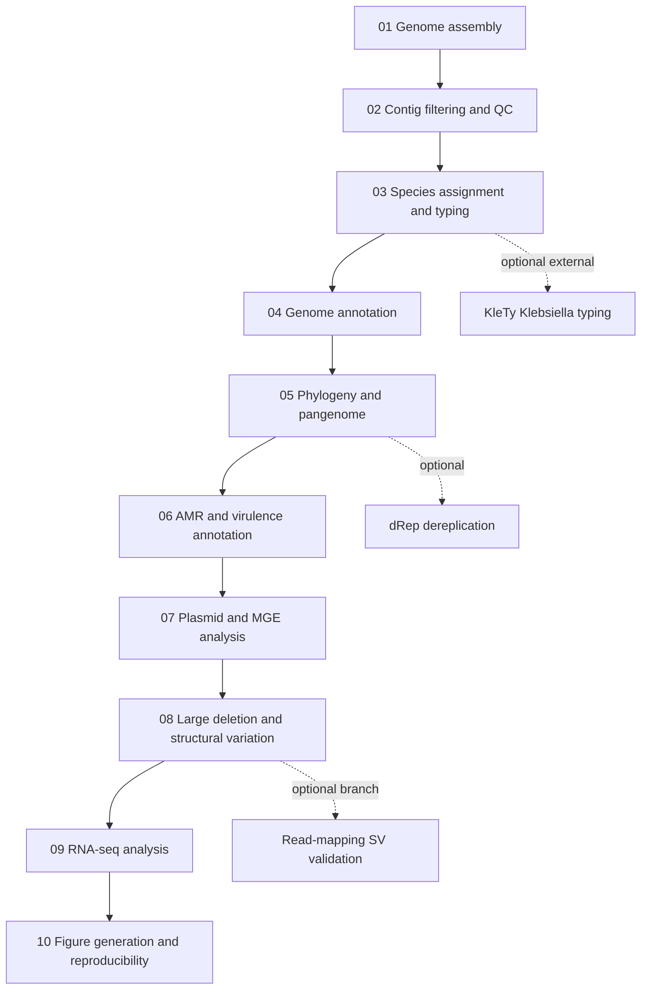

# Workflow

This repository implements the manuscript workflow as numbered stages under `pipeline/`.

Default execution order in `pipeline/run_all.sh` is:

1. Genome assembly
2. Contig filtering and QC
3. Species assignment and typing
4. Genome annotation
5. Panaroo
6. MAFFT
7. AMR and virulence annotation
8. Plasmid and mobile genetic element analysis
9. Large deletion and structural variation analysis
10. RNA-seq analysis
11. Figure generation and reproducibility

Optional scripts are kept outside the default workflow unless explicitly enabled, such as `RUN_DREP=true`.
